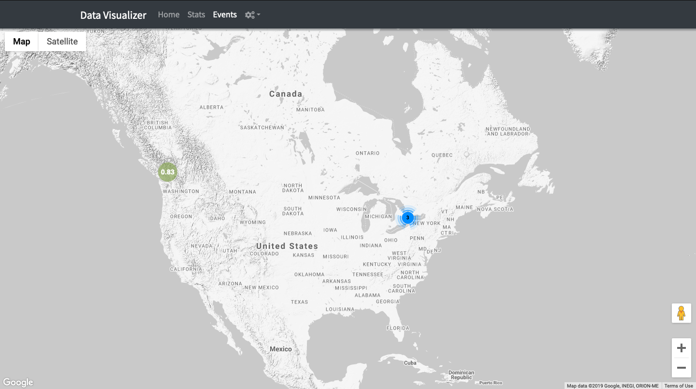

# EQ Works Work Sample

## `/events`
### Structure
- date: date [PK]
- hour: int [PK]
- events: int
- poi_id: int [FK]

### Features
- View all data for a given year
- View **hourly, daily and monthly** tables
- View chart to show **event vs time**
- Filter by month query
- Show **intensity** of events by location

## `/stats`
### Structure
- date: date [PK]
- hour: int
- impressions: int
- revenue: numeric(19,13)
- poi_id: int [FK]

### Features
- View all data for a given year
- View **hourly, daily and monthly** tables
- View chart to show **event vs time**
- Filter by month query using Fuse.js fuzzy search
- Show **intensity** of data by location based on impressions/clicks/revenue

## Improvements
- Using a stream JSON parser would improve initial dataset load time
- WASM with Ruby or typescript to sort/parse data would significantly improve loadtime
- Paging would also improve initial load time as updating DOM is expensive work
- Using [leaflet](https://leafletjs.com) with OpenStreetMap interactive maps for data visualization would significantly improve map visualization experience.

## Requirements
- This requires a google maps API key to be included in `/resources/config.json` to load google maps.

## Incomplete
- Express rate limiting was not implemented

## Express API
Express API has been significantly improved to accomodate for the front-end changes and design. It seemed easier to load yearly data and have the client-side app sort and page them as required. This meant **load once** approach instead of lazy load which improves searching and data visualization drastically.